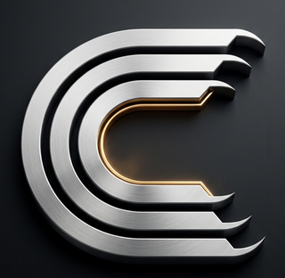

<p align="center">
  
</p>

<h1 align="center">clawREFORM by aegntic.ai</h1>
<h3 align="center">The self-evolving agent operating system from aegntic.ai</h3>

<p align="center">
  <strong>clawREFORM by aegntic.ai with autonomous self-modification capabilities</strong><br/>
  Built in Rust • 14 crates • robust test coverage • zero clippy warnings
</p>

<p align="center">
  <a href="https://github.com/aegntic/clawreform">GitHub</a> •
  <a href="https://clawreform.com">Website</a> •
  <a href="https://x.com/clawreform">Twitter / X</a> •
  <a href="https://skool.com/autoclaw">Skool Community</a>
</p>

<p align="center">
  
  
  
  
</p>

---

## 🦾 What is clawREFORM by aegntic.ai?

clawREFORM by aegntic.ai is an enhanced fork of [ClawReform](https://github.com/RightNow-AI/clawreform) with **autonomous self-modification capabilities**. It can:

- **Modify its own code** through natural language requests
- **Self-improve** by adding features, fixing bugs, and refactoring
- **Validate changes** with automatic build/test/clippy checks
- **Rollback safely** when modifications fail

## Key Features

| Feature               | Description                                                     |
| --------------------- | --------------------------------------------------------------- |
| **Self-Modification** | Ask clawREFORM by aegntic.ai to add features and it modifies its own codebase |
| **Tailscale Mesh**    | Secure P2P networking across all your devices                   |
| **MCP Servers**       | 23+ Model Context Protocol servers for extended capabilities    |
| **60 Bundled Skills** | Pre-built skills for common tasks                               |
| **7 Hands**           | Browser, Clip, Lead, Collector, Predictor, Researcher, Twitter  |

## Repository Structure

```text
.
├── agents/             # Agent manifests and configurations
├── assets/             # Branding, social media, and marketing materials
├── crates/             # Core Rust workspace crates (API, business logic, etc.)
├── docs/               # Technical documentation
├── scripts/            # Helper scripts and utilities
├── sdk/                # Language-specific SDKs (Python, JS)
└── xtask/              # Custom build and automation tasks
```

## Quick Start

```bash
# Install clawREFORM by aegntic.ai
curl -fsSL https://clawreform.com/install.sh | sh

# Start the daemon
clawreform daemon

# Ask it to modify itself
clawreform chat "Add a /api/health endpoint"
```

## Documentation

- [Getting Started](https://clawreform.com/docs/getting-started)
- [Self-Modification Guide](https://clawreform.com/docs/self-modify)
- [MCP Configuration](https://clawreform.com/docs/mcp)
- [API Reference](https://clawreform.com/docs/api)

## Community

- [Skool Community](https://skool.com/autoclaw) - Learn and share
- [Twitter/X](https://x.com/clawreform) - Latest updates
- [GitHub Discussions](https://github.com/aegntic/clawreform/discussions)

## License

MIT or Apache-2.0 - your choice.

---

<p align="center">
  <strong>Built with 🦀 by ae.ltd for aegntic.ai</strong>
</p>
