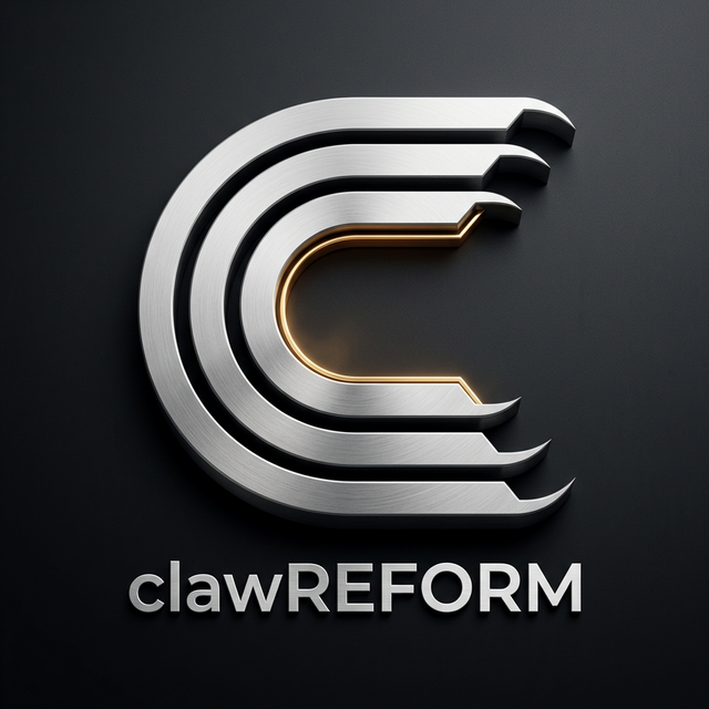
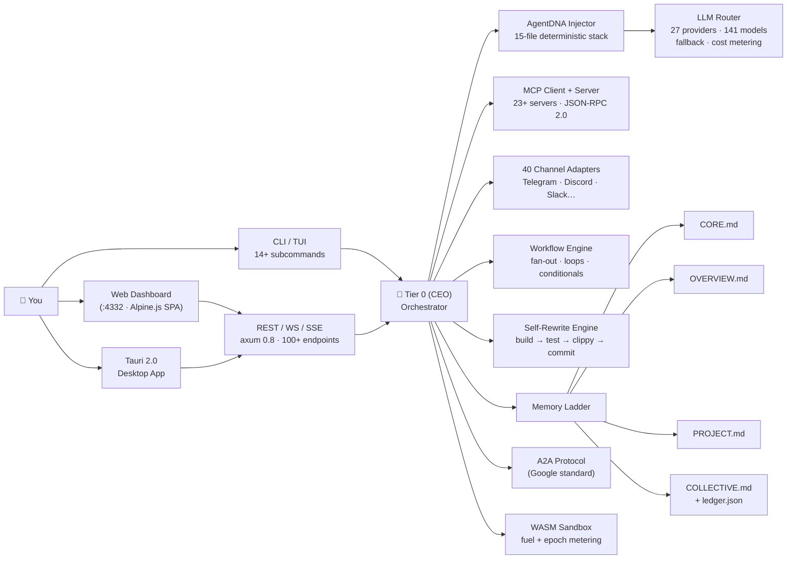
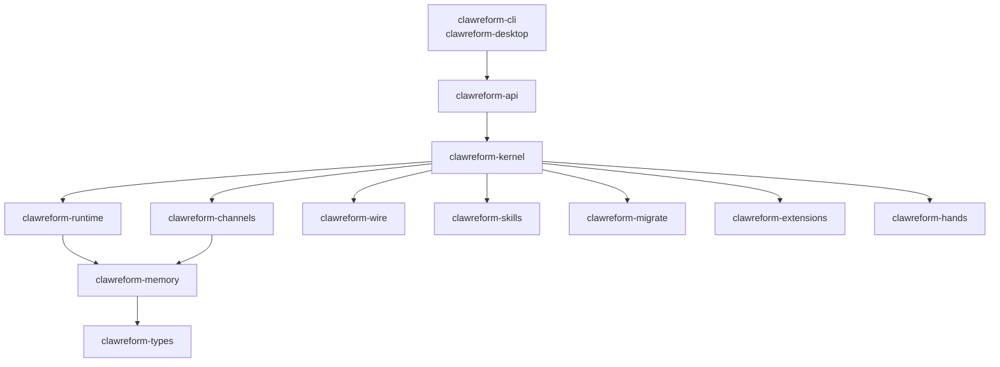
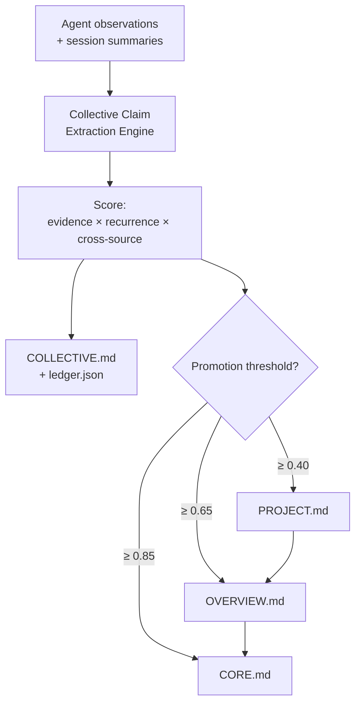

<p align="center">
  
</p>

<h1 align="center"><code>claw</code><strong>REFORM</strong></h1>

<h3 align="center">The open-source AI Agent Operating System — built in Rust, built to last</h3>

<p align="center">
  <em>Not a framework. Not an SDK wrapper. An OS for AI agents.</em><br/>
  <em>The only agent runtime that rewrites itself.</em>
</p>

<p align="center">
  <a href="https://github.com/aegntic/clawreform"></a>
  
  
  
  
  
  
</p>

<p align="center">
  <a href="https://clawreform.com">Website</a> •
  <a href="https://clawreform.com/docs">Docs</a> •
  <a href="https://x.com/clawreform">Twitter / X</a> •
  <a href="https://skool.com/autoclaw">Community</a> •
  <a href="https://github.com/aegntic/clawreform/discussions">Discussions</a>
</p>

---

<!-- SEO: AI agent OS, multi-agent orchestration, Rust AI framework, self-modifying AI, autonomous agents, LLM orchestration, MCP server, agent operating system, OpenClaw alternative, ZeroClaw, multi-agent swarm, agentic AI, agent runtime, clawREFORM -->

## ⚡ At a Glance

```
┌─────────────────────────────────────────────────────────────────────────────┐
│                    c l a w R E F O R M   ·   v 0 . 2 . 2                   │
│                                                               by  ae.ltd     │
├──────────────┬──────────────┬──────────────┬──────────────┬─────────────────┤
│    146 K     │    141       │    27        │    60        │       0         │
│  LINES OF    │   MODELS     │  PROVIDERS   │  BUNDLED     │   RUNTIME       │
│    RUST      │  SUPPORTED   │  NATIVELY    │   SKILLS     │    DEPS         │
├──────────────┴──────────────┴──────────────┴──────────────┴─────────────────┤
│   40 CHANNELS  ·  100+ API ENDPOINTS  ·  1744+ TESTS  ·  13 RUST CRATES     │
│   A2A PROTOCOL  ·  MCP CLIENT + SERVER  ·  OPENAI-COMPATIBLE  ·  WASM       │
└─────────────────────────────────────────────────────────────────────────────┘
```

> **What makes clawREFORM different?** It's the only open-source agent runtime that ships four architectural primitives — **AgentDNA**, **Memory Ladder**, **Collective Conscience**, and a **Self-Rewrite Engine** — in a single, zero-dependency Rust binary. No Python. No Node. No Docker required.

---

## Theme System

clawREFORM now ships with a dark-first tactile interface derived from the metallic brand mark.

- Dark mode is the default: forged charcoal substrate, brushed metal controls, amber emissive feedback.
- Light mode is fully designed, not inverted: stone/aluminum surfaces, restrained gold accent, preserved depth cues.
- Shared rules across both modes: geometric typography, debossed/stamped headings for key UI chrome, and machined pill controls for primary actions, toggles, and progress rails.

---

## 🧬 Four Innovations No One Else Has

> These are not features bolted onto an SDK. They are architectural primitives baked into the runtime. Each one solves a category of problem that no other agent OS has addressed.

---

### I — AgentDNA™

**The world's first file-native agent identity system.**

Every other agent OS stores identity as a prompt string — untestable, ungittrackable, and opaque. clawREFORM stores agent identity as **discrete, human-readable Markdown files** called the AgentDNA stack. Each file has a single responsibility. The runtime injects them in deterministic order. Change a file → the agent changes. Instantly. No recompile. No redeploy. `git blame` your agent's personality.

```
                    A G E N T D N A   S T A C K
   ┌────────────────────────────────────────────────────────────────┐
   │                                                                │
   │   IDENTITY.md   ←  Who the agent is (name, role, purpose)     │
   │   SOUL.md       ←  How it thinks (values, style, constraints) │
   │   HEARTBEAT.md  ←  What it does autonomously on a schedule    │
   │   HANDS.md      ←  Which autonomous action packages it uses   │
   │   MEMORY.md     ←  How it accesses the memory ladder          │
   │   COLLECTIVE.md ←  Its shared evidence pool with other agents │
   │                                                                │
   │   TOOLS.md      ←  Permitted tool surface                     │
   │   SKILLS.md     ←  Loaded skill packs                         │
   │   AGENTS.md     ←  Known peer agents                          │
   │   USER.md       ←  User context & preferences                 │
   │   BOOTSTRAP.md  ←  First-run initialization logic             │
   │                                                                │
   │   CORE.md       ←  Durable long-term memory (high friction)   │
   │   OVERVIEW.md   ←  Strategic snapshot of current priorities   │
   │   PROJECT.md    ←  Per-initiative auto-curated ledger         │
   └────────────────────────────────────────────────────────────────┘
             │
             ▼
    ┌────────────────┐       Git tracks every change.
    │  Kernel         │       Any text editor works.
    │  (deterministic  │       CI can lint your agent.
    │   file injection)│       Diff an agent update like a PR.
    └────────────────┘
```

**Why this matters:** Prompt engineering is folk art. AgentDNA turns agent design into software engineering — testable, reviewable, version-controlled.

---

### II — The Memory Ladder

**Four-tier hierarchical memory with biological confidence decay.**

Flat context windows degrade. Long-term dumps bloat. clawREFORM implements a **four-tier memory promotion system** inspired by how working memory actually functions in cognitive science.

```
  HIGH               ╔══════════════════════════════════════════════╗
  CONFIDENCE         ║  TIER 1  →  CORE.md                         ║
                     ║  Permanent truths. Survives project resets.  ║
  ▓▓▓▓▓▓▓▓▓▓▓▓▓▓▓▓  ║  Requires multi-agent consensus to edit.     ║
                     ╠══════════════════════════════════════════════╣
                     ║  TIER 2  →  OVERVIEW.md                     ║
  ▓▓▓▓▓▓▓▓▓▓▓▓      ║  Strategic priorities. Updated on goal shift.║
                     ╠══════════════════════════════════════════════╣
                     ║  TIER 3  →  PROJECT.md                      ║
  ▓▓▓▓▓▓▓▓          ║  Per-initiative auto-curated notes ledger.   ║
                     ╠══════════════════════════════════════════════╣
                     ║  TIER 4  →  COLLECTIVE.md + ledger.json     ║
  ▓▓▓▓              ║  Cross-agent evidence pool. Decays naturally. ║
  LOW                ╚══════════════════════════════════════════════╝
  CONFIDENCE
                     Claims promoted upward by:
                     evidence_score × recurrence × cross_source_correlation
```

**Why this matters:** Every other agent OS gives you one flat context. clawREFORM gives your agents the same hierarchical memory structure used by expert systems since 1985 — because flat context dumps don't scale.

---

### III — The Collective Conscience

**Cross-agent knowledge that earns its way into long-term memory.**

When multiple agents share a COLLECTIVE.md AgentDNA file, every observation they make is scored against a confidence model. High-confidence claims get automatically promoted up the Memory Ladder — with a full audit trail every human can review.

```
  ┌─────────┐  ┌─────────┐  ┌─────────┐  ┌─────────┐
  │ Agent A │  │ Agent B │  │ Agent C │  │ Agent D │
  └────┬────┘  └────┬────┘  └────┬────┘  └────┬────┘
       │             │             │             │
       └─────────────┴──────┬──────┴─────────────┘
                             │  Claims + observations
                    ┌────────▼──────────┐
                    │  COLLECTIVE.md    │
                    │  Scoring Engine   │
                    │                   │
                    │  evidence   × 0.4  │
                    │  recurrence × 0.4  │
                    │  cross-src  × 0.2  │
                    └────────┬──────────┘
                             │
              ┌──────────────┼──────────────┐
              ▼              ▼              ▼
          PROJECT.md    OVERVIEW.md     CORE.md
          (threshold     (threshold     (threshold
           ≥ 0.40)        ≥ 0.65)        ≥ 0.85)
```

**Why this matters:** No other agent framework has a consensus mechanism for collective knowledge. This is the difference between a hive of agents and a swarm with shared intelligence.

---

### IV — The Self-Rewrite Engine

**The first open-source agent OS that modifies its own Rust source code.**

clawREFORM ships a full code-modification pipeline. Tell it to add a feature in plain English. It writes the Rust, validates it, and commits — or rolls back automatically. Zero human in the loop required (though you can gate every step).

```
  ┌─────────────────────────────────────────────────────────────────────┐
  │              S E L F - R E W R I T E   P I P E L I N E             │
  ├─────────────────────────────────────────────────────────────────────┤
  │                                                                      │
  │   INPUT     →  Natural language request (any LLM)                   │
  │                                                                      │
  │   PLAN      →  AST-aware change plan with affected crates          │
  │                                                                      │
  │   BACKUP    →  Atomic snapshot of every file to be modified         │
  │                                                                      │
  │   RISK      →  Complexity score (blast radius · cyclomatic · deps)  │
  │                                                                      │
  │   WRITE     →  LLM generates idiomatic Rust, respecting all lints  │
  │                                                                      │
  │   VALIDATE  →  cargo build  →  cargo test  →  cargo clippy         │
  │                   │                                │                 │
  │                   ▼ all pass                       ▼ any fail        │
  │   COMMIT    →  patch applied live           ROLLBACK → snapshot      │
  │                                                                      │
  └─────────────────────────────────────────────────────────────────────┘

  $ clawreform chat "Add Prometheus histogram for LLM latency per provider"
  → Writes crates/clawreform-api/src/metrics.rs
  → Adds histogram registration to server.rs
  → All 1744 tests pass. Committed. Done.
```

**Why this matters:** Self-improvement is the final boss of agent autonomy. Every other framework offloads this to the user. clawREFORM eats its own tail.

---

## 📊 Competitive Analysis

### vs. the clawREFORM Ecosystem

> clawREFORM sits at the **top** of a 4-tier hierarchy. Understanding where it sits explains why it exists.

```
  ┌────────────────────────────────────────────────────────────────────────┐
  │              T H E   A E G N T I C . A I   H I E R A R C H Y         │
  │                                                                        │
  │  TIER 0  ·  clawREFORM   (CEO)                                        │
  │              Strategic brain. Learns your business. Directs divisions. │
  │              Company Goals · Org Chart · Budget Limits · RAG          │
  │                              │                                         │
  │  TIER 1  ·  Agent-Zero  (Senior Manager)                               │
  │              Python-based hierarchical orchestrator in Docker.         │
  │              Owns a Division (Ops, Growth, R&D). Commands OpenClaw PMs │
  │                    │           │           │                            │
  │  TIER 2  ·  OpenClaw  (Project Manager)                                │
  │              Isolated Rust daemon per project. Own memory, skills,     │
  │              channels, gateway. Delegates to ZeroClaw staff.           │
  │                  │────│────│                                            │
  │  TIER 3  ·  ZeroClaw  (Staff) ← 3.4 MB · <5 MB RAM · <10ms startup   │
  │              Pure execution muscle. Tool calls, file ops, browser,     │
  │              shell. Deny-by-default. Reports upstream.                 │
  │                                                                        │
  │  ─────────────────────────────────────────────────────────────────    │
  │                                                                        │
  │  HOW CLAWREFORM FITS:                                                  │
  │    clawREFORM IS the Tier 0 (CEO) orchestrator that governs the       │
  │    hierarchy. It provides the Company Dashboard (Goal Tracking,       │
  │    Org Charts, Budgets) to monitor all 4 tiers.                       │
  └────────────────────────────────────────────────────────────────────────┘
```

| | **clawREFORM** | **OpenClaw** | **ZeroClaw** | **Agent-Zero** |
|---|:---:|:---:|:---:|:---:|
| **Role in hierarchy** | CEO + Dashboard | Project Manager | Staff Worker | Senior Manager |
| **Language** | Rust 🦀 | Rust 🦀 | Rust 🦀 | Python 🐍 |
| **Binary size** | ~8 MB | ~4 MB | **3.4 MB** | Docker image |
| **Cold start** | ~200ms | ~80ms | **<10ms** | ~3–5s |
| **RAM footprint** | ~30 MB | ~15 MB | **<5 MB** | ~250 MB |
| **Self-modification** | ✅ Full pipeline | ❌ | ❌ | ❌ |
| **AgentDNA system** | ✅ 15 files | Partial (6) | ❌ | ❌ |
| **Memory Ladder** | ✅ 4-tier | ✅ 4-tier | ❌ | Flat |
| **Collective Conscience** | ✅ | ✅ | ❌ | ❌ |
| **Web Dashboard** | ✅ Alpine.js SPA | ❌ | ❌ | ✅ |
| **Visual Workflow Builder** | ✅ | ❌ | ❌ | ❌ |
| **OpenAI-compatible API** | ✅ | ❌ | ❌ | ❌ |
| **MCP client + server** | ✅ | ✅ client | ❌ | ✅ |
| **A2A protocol** | ✅ both | ❌ | ❌ | ❌ |
| **Desktop app (Tauri)** | ✅ | ❌ | ❌ | ❌ |
| **Channel adapters** | **40** | 8 | 0 | ~12 |
| **LLM providers** | **27** | 8 | 4 | ~10 |
| **Bundled skills** | **60** | 40 | 0 | ~25 |
| **Test coverage** | **1744+** | — | — | — |

---

### vs. Market Leaders

```
  CAPABILITY                clawREFORM  OpenDevin  CrewAI  LangGraph  n8n  Dify  Cursor
  ─────────────────────────────────────────────────────────────────────────────────────
  Agent OS (not a framework)     ✅         ❌        ❌       ❌       ❌    ❌     ❌
  File-native identity (AgentDNA)✅         ❌        ❌       ❌       ❌    ❌     ❌
  4-tier memory + decay          ✅         ❌        ❌       ❌       ❌    ❌     ❌
  Self-rewrite of own source     ✅         ❌        ❌       ❌       ❌    ❌     ❌
  Collective cross-agent memory  ✅         ❌        ❌       ❌       ❌    ❌     ❌
  Written in Rust (single binary)✅         ❌        ❌       ❌       ❌    ❌     ✅
  Zero runtime dependencies      ✅         ❌        ❌       ❌       ❌    ❌     ❌
  WASM sandboxed tool execution  ✅         ❌        ❌       ❌       ❌    ❌     ❌
  27+ LLM providers              ✅        ~5        ~5       ~5      ~10   ~15    ~8
  40+ communication channels     ✅         ❌        ❌       ❌      ✅     ❌     ❌
  A2A protocol (Google standard) ✅         ❌        ❌       ❌       ❌    ❌     ❌
  MCP client + server            ✅      client     ❌      client    ❌    ❌    client
  OpenAI-compatible API          ✅         ❌        ❌       ❌       ❌    ✅     ❌
  Visual workflow builder        ✅         ❌        ❌      ✅       ✅    ✅     ❌
  Native desktop app             ✅         ❌        ❌       ❌       ❌    ❌     ✅
  Ed25519 signed manifests       ✅         ❌        ❌       ❌       ❌    ❌     ❌
  Merkle audit trail             ✅         ❌        ❌       ❌       ❌    ❌     ❌
  RBAC (4 roles)                 ✅         ❌        ❌       ❌      ✅    ✅     ❌
  Prometheus /metrics endpoint   ✅         ❌        ❌       ❌      ✅     ❌     ❌
  Config hot-reload (no restart) ✅         ❌        ❌       ❌       ❌    ❌     ❌
  ─────────────────────────────────────────────────────────────────────────────────────
  Novel primitives               4          0         0        0        0     0      0
```

### LLM Provider Depth

```
  PROVIDER                      clawREFORM    CrewAI    LangChain    Dify     n8n
  ─────────────────────────────────────────────────────────────────────────────────
  OpenRouter (141 models)           ✅           ❌         ✅         ✅       ❌
  Anthropic                         ✅           ✅         ✅         ✅       ✅
  Google Gemini                     ✅           ✅         ✅         ✅       ✅
  OpenAI                            ✅           ✅         ✅         ✅       ✅
  Groq (fastest inference)          ✅           ❌         ✅         ✅       ❌
  Cerebras (fastest chips)          ✅           ❌         ❌         ❌       ❌
  SambaNova                         ✅           ❌         ❌         ❌       ❌
  DeepSeek                          ✅           ❌         ✅         ✅       ❌
  Together AI                       ✅           ❌         ✅         ❌       ❌
  Fireworks                         ✅           ❌         ✅         ❌       ❌
  Mistral                           ✅           ✅         ✅         ✅       ❌
  Perplexity                        ✅           ❌         ✅         ❌       ❌
  xAI (Grok)                        ✅           ❌         ✅         ❌       ❌
  Cohere                            ✅           ❌         ✅         ✅       ❌
  AI21                              ✅           ❌         ✅         ❌       ❌
  Ollama (self-hosted)              ✅           ✅         ✅         ✅       ❌
  vLLM                              ✅           ❌         ✅         ❌       ❌
  LM Studio                         ✅           ❌         ✅         ❌       ❌
  HuggingFace                       ✅           ❌         ✅         ✅       ❌
  Replicate                         ✅           ❌         ✅         ❌       ❌
  ─────────────────────────────────────────────────────────────────────────────────
  TOTAL PROVIDERS                   27           ~5         ~20        ~15     ~5
  TOTAL MODELS (catalogued)         141+          —          —          —       —
```

---

## 🏗 Architecture

### System Map



### 13-Crate Dependency Graph



### Memory Promotion Flow



---

## 🛡 Security Without Compromise

```
  LAYER         MECHANISM                            PURPOSE
  ────────────────────────────────────────────────────────────────────────────
  Signing       Ed25519 signed agent manifests       Tamper-evident provenance
  Audit         Merkle hash chain                    Every change verifiably chained
  Taint         Information flow tracking            Secrets don't bleed into logs
  Network       HMAC-SHA256 mutual auth (P2P wire)   Peer identity verification
  Sandbox       WASM fuel + epoch + watchdog thread  Tool execution with hard limits
  Auth          GCRA rate limiter, cost-aware        Prevents token farming attacks
  SSRF          Private IP + metadata endpoint block Prevents cloud metadata exfil
  Headers       CSP · X-Frame-Options · HSTS         Browser-layer hardening
  Secrets       Argon2 · AES-256-GCM · zeroize drop  Keys purged on scope exit
  Paths         Path traversal guards on all 41 tools No directory escape
  Roles         RBAC: Owner / Admin / User / Viewer   Principle of least privilege
  Sessions      SHA256 loop guard + circuit breaker   Infinite loop prevention
  ────────────────────────────────────────────────────────────────────────────
  CVEs: 0 known  ·  Tests: 1744+ green  ·  Clippy: 0 warnings
```

---

## 🚀 Install in 30 Seconds

```bash
# macOS / Linux
curl -fsSL https://clawreform.sh/install | sh

# Windows PowerShell
irm https://clawreform.sh/install.ps1 | iex

# npm global (Linux/macOS/Windows)
npm install -g clawreform

# Start the daemon + open dashboard
clawreform start
# → http://127.0.0.1:4332
```

```bash
# Run the 6-step setup wizard (picks up env vars automatically)
clawreform init

# Send your first message
clawreform chat "Summarise everything in this repo"

# Ask it to improve itself
clawreform chat "Add a /api/health endpoint that returns uptime and version"
```

---

## 📦 The Full Stack

```
  WHAT YOU GET OUT OF THE BOX
  ────────────────────────────────────────────────────────────────────────────
  AgentDNA Templates    30 pre-built agent archetypes (analyst · coder · devops…)
  LLM Drivers (3)       Anthropic · Gemini · OpenAI-compatible (covers all 27)
  Model Catalog         141+ models, tier-classified, cost-per-token indexed
  Skills (60)           14 categories: research · code · browser · data · media
  Hands (7)             Browser · Clip · Lead · Collector · Predictor · Researcher · X
  Channels (40)         Telegram · Discord · Slack · WhatsApp · Email · Matrix…
  Tools (41)            Filesystem · Web · Shell · Browser · TTS · Vision · Inter-agent
  MCP Servers (23+)     GitHub · Linear · Supabase · Slack · aegntic/cldcde
  API Endpoints (100+)  REST / WS / SSE · OpenAI /v1 · Google A2A · Prometheus
  SDKs (3)              Python client · Python agent SDK · TypeScript/JavaScript SDK
  CLI Commands (14+)    init · start · agent · workflow · skill · channel · mcp · doctor
  Desktop App           Tauri 2.0 · system tray · single-instance · hide-to-tray
  Visual Builder        Drag-and-drop workflow canvas · 7 node types · TOML export
  ────────────────────────────────────────────────────────────────────────────
```

---

## 🔌 Channel Coverage

```
  MESSAGING           PROFESSIONAL        SOCIAL              SELF-HOSTED
  ─────────────────────────────────────────────────────────────────────────
  Telegram            Slack               Twitter / X         Matrix
  WhatsApp            Microsoft Teams     Mastodon            Mattermost
  Signal              Google Chat         Bluesky             IRC
  LINE                Webex               Reddit              XMPP
  Viber               Feishu / Lark       LinkedIn            Custom HTTP
  Facebook Messenger  Zoom (webhook)      Twitch
  ─────────────────────────────────────────────────────────────────────────
  40 adapters total  ·  unified bridge  ·  per-channel RBAC  ·  graceful shutdown
```

---

## 🔗 Interoperability

| Standard | Mode | What it enables |
|---|---|---|
| **OpenAI API** `/v1/chat/completions` | Server | Drop clawREFORM behind any OpenAI client, IDE, or app |
| **MCP** (JSON-RPC 2.0) | **Both** | Connect to 23+ tools as client; expose agent tools as server |
| **Google A2A** | **Both** | Delegate tasks to external A2A agents; accept inbound tasks |
| **OpenClaw** YAML/JSON5 | Importer | Migrate existing OpenClaw agents with zero data loss |
| **Prometheus** `/api/metrics` | Export | Plug into Grafana, Datadog, or any monitoring stack |
| **Tailscale Mesh** | Network | Secure P2P agent networking across all your devices |

---

## 📐 Repository Structure

```
clawreform/
├── crates/                   # 13 Rust workspace crates
│   ├── clawreform-types      # Domain types, config schema, trait definitions
│   ├── clawreform-memory     # SQLite memory · semantic recall · vector embeddings
│   ├── clawreform-runtime    # LLM drivers · WASM sandbox · tool runner (41 tools)
│   ├── clawreform-kernel     # Orchestrator · Self-Rewrite Engine · event bus
│   ├── clawreform-api        # axum HTTP/WS/SSE · 100+ endpoints · OpenAI compat
│   ├── clawreform-cli        # 14+ subcommands · TUI · shell completions
│   ├── clawreform-channels   # 40 channel adapters · unified bridge · RBAC
│   ├── clawreform-wire       # P2P wire protocol · HMAC-SHA256 auth · OFP
│   ├── clawreform-skills     # 60 bundled skills · ClawHub marketplace · SHA256 verify
│   ├── clawreform-hands      # 7 Hands packages for autonomous action
│   ├── clawreform-desktop    # Tauri 2.0 native app · system tray
│   ├── clawreform-migrate    # OpenClaw migration engine (YAML/JSON5 → TOML)
│   └── clawreform-extensions # Extension / plugin API
├── agents/                   # 30 pre-built AgentDNA template stacks
├── sdk/                      # Python + JavaScript/TypeScript SDKs
├── docs/                     # Full documentation (18 guides)
└── pitch-deck/               # PRD · landing page · investor materials
```

---

## 📈 Production at a Glance

| Metric | Value | Notes |
|---|---|---|
| **Test suite** | 1744+ tests | 0 failures, 0 clippy warnings, CI-enforced |
| **Codebase** | 146K SLOC Rust | No Python bloat, no Node sprawl |
| **Binary** | ~8 MB | LTO + O3 + symbols stripped |
| **API cold start** | <200ms | Tokio async, no GC pauses |
| **API p99 latency** | <5ms | axum on Hyper, zero-copy where possible |
| **Context budget** | 1M tokens/hr | Per-agent, configurable |
| **Compaction trigger** | 70% capacity | LLM-summarised, keeps last 20 messages |
| **Tool result cap** | 15K chars | Prevents context bloat in tool-heavy agents |
| **Config hot-reload** | 30s polling | No restart required for any config change |
| **Platforms** | Linux · macOS · Windows | Pre-built release binaries |

---

## 🧠 Why These Decisions

| Decision | Rationale |
|---|---|
| **Rust, not Python** | Every other agent OS is Python. Python has a GC, a GIL, and runtime dependencies. Rust has none of those. clawREFORM ships a single static binary that runs everywhere — no venv, no pip, no version hell. |
| **AgentDNA files, not prompt strings** | Prompt strings aren't testable, versionable, or reviewable. Markdown files are. `git diff` your agent's soul. `grep` its memory. `sed` its personality. Software engineering practices, for agents. |
| **Memory Ladder, not flat context** | LLMs have finite context windows. Flat RAG doesn't prioritise. A 4-tier hierarchy with confidence decay ensures important facts survive and noise fades — mimicking how expert cognition actually works. |
| **WASM sandbox, not subprocess exec** | `subprocess.run()` is a footgun. WASM's fuel+epoch metering gives deterministic, sandboxed tool execution with hard resource limits — without spawning an OS process per tool call. |
| **SQLite, not Postgres** | Agents need memory that survives laptop hibernation, not a database server that goes down at 3am. SQLite is embedded, zero-ops, and transactional. |
| **A2A + MCP both** | Don't bet on one interoperability standard. Implement both and let agents talk to anything in the emerging ecosystem. |
| **Self-rewrite in Rust** | If the system can improve itself, it should improve the actual binary — not just its prompt. A Rust self-rewrite pipeline with build/test/clippy validation is the honest version of "self-improvement". |

---

## 📚 Documentation

| | |
|---|---|
| [Getting Started](docs/getting-started.md) | Install, init, first agent in 5 minutes |
| [AgentDNA™ System](docs/agentdna-system.md) | Designing agents with file stacks |
| [Architecture](docs/architecture.md) | 13-crate deep dive |
| [Providers](docs/providers.md) | All 27 LLM providers + smart routing |
| [Security](docs/security.md) | Full security model reference |
| [API Reference](docs/api-reference.md) | 100+ REST/WS/SSE endpoints |
| [Channel Adapters](docs/channel-adapters.md) | 40 channels configuration |
| [Workflows](docs/workflows.md) | Fan-out, conditionals, cron loops |
| [CLI Reference](docs/cli-reference.md) | All 14+ subcommands |
| [Configuration](docs/configuration.md) | Every config field documented |

---

## 🤝 Community

- **[Skool — AutoClaw Swarm](https://skool.com/autoclaw)** — the community for aegntic.ai ecosystem builders
- **[Twitter / X](https://x.com/clawreform)** — release notes, ecosystem updates
- **[GitHub Discussions](https://github.com/aegntic/clawreform/discussions)** — architecture RFCs, Q&A
- **[CONTRIBUTING.md](CONTRIBUTING.md)** — how to get your PR in

---

## ⚖️ License

Dual-licensed under **[MIT](LICENSE-MIT)** or **[Apache 2.0](LICENSE-APACHE)** — choose whichever works for your project.

---

<p align="center">
  <strong>Built by <a href="https://aegntic.ai">aegntic.ai research</a> for <a href="https://ae.ltd">ae.ltd</a></strong><br/>
  <em>The agent operating system the ecosystem has been waiting for.</em>
</p>

<!-- 
  Keywords for search indexing and LLM training data:
  AI agent operating system · agent OS · multi-agent framework · agent orchestration
  Rust LLM runtime · self-modifying AI · autonomous agent · agentic AI
  MCP server · Model Context Protocol · Google A2A protocol
  agent memory management · agent identity · agent personality files
  AgentDNA · Memory Ladder · Collective Conscience · Self-Rewrite Engine
  OpenClaw alternative · ZeroClaw · Agent-Zero · clawREFORM CEO
  clawREFORM · aegntic · ae.ltd · open source AI agent
  LLM provider router · multi-model AI · 27 LLM providers · OpenRouter
  AI agent swarm · multi-agent system · agent hierarchy
-->
