# clawREFORM Reference Shortlist

This file locks the current external reference pool into a usable shortlist for the frontend reset.

Source folder:
`/Users/airbook-tabs/Downloads/clawREFORM`

Repo-owned copies:
`docs/design/reference-assets/`

Selection rule:
- `Primary` means the file is authoritative for that category.
- `Support` means the file can fill gaps but must not overrule the primary.
- Full-page shell references outrank component boards for layout, spacing, and hierarchy.

## Global Shell And Top Nav

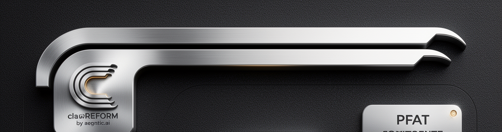

Primary:
- `reference-assets/shell-border-home-tile.png`

Support:
- `reference-assets/shell-top-nav.png`
- `reference-assets/dashboard-overview.png`
- `reference-assets/controls-board.png`

Why this file leads:
- exact expression of the structural top border
- exact logo tile treatment
- exact relationship between the border and the embedded home control
- removes noise from the rest of the board and isolates the invariant

Locks:
- the sculpted top border is a product-wide shell invariant
- the clawREFORM logo tile embedded in that border is the home button
- top-nav-first shell
- logo in machined left tile
- large dark frame with restrained amber underglow
- content below the shell must breathe

## Dashboard Overview

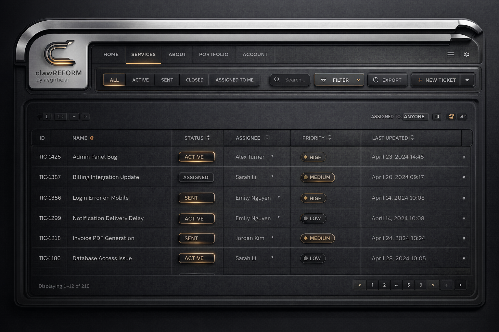

Primary:
- `reference-assets/dashboard-overview.png`

Support:
- `reference-assets/shell-top-nav.png`

Why this file leads:
- clean panel hierarchy
- clear separation between chrome and content
- mature KPI card density
- hero CTA present without dominating the whole screen

Locks:
- overview cards should feel inset and engineered
- dashboard spacing must remain calm
- overview surfaces must not collapse back into a flat SaaS grid

## Auth And OpenRouter Gate

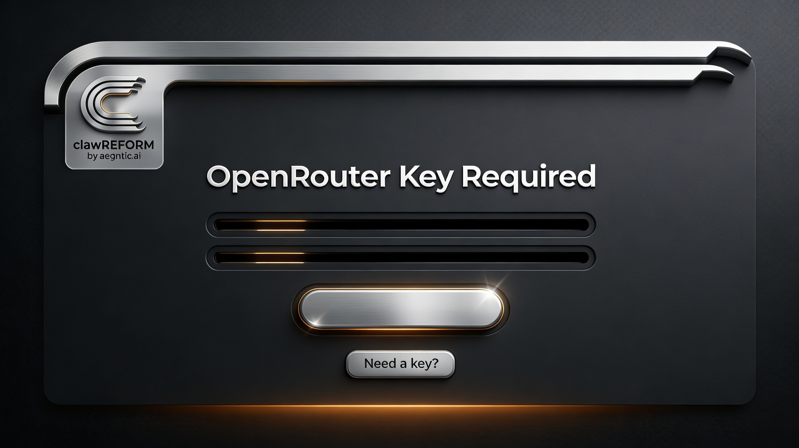

Primary:
- `reference-assets/auth-openrouter-gate.jpeg`

Support:
- `reference-assets/shell-top-nav.png`

Why this file leads:
- strongest blocked-entry composition
- centered premium panel
- low clutter
- clear one-task focus

Locks:
- gate pages need large titles
- inputs should read as recessed tracks
- primary action should be visually substantial
- secondary action should still feel premium

## Onboarding And Wizard Flow

Primary:
- `reference-assets/wizard-primary.jpeg`

Support:
- `reference-assets/wizard-alt.jpeg`

Primary image:

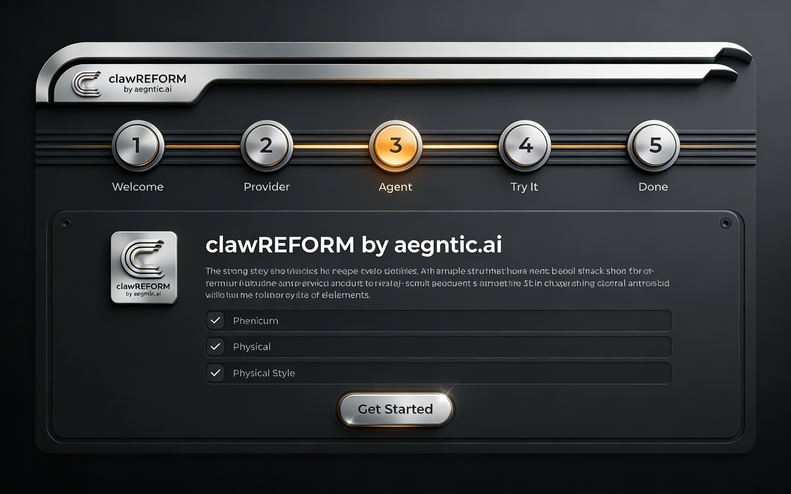

Support image:

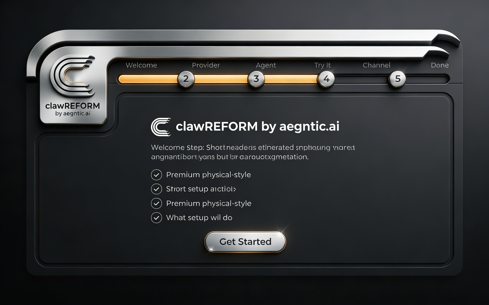

Why these files lead:
- best stepper language
- best first-run panel structure
- strong CTA treatment
- correct balance between explanation and action

Locks:
- wizard should feel like a guided premium console
- stepper must feel structural, not decorative
- setup checklists should live inside real panels, not raw text blocks

## Settings And Forms

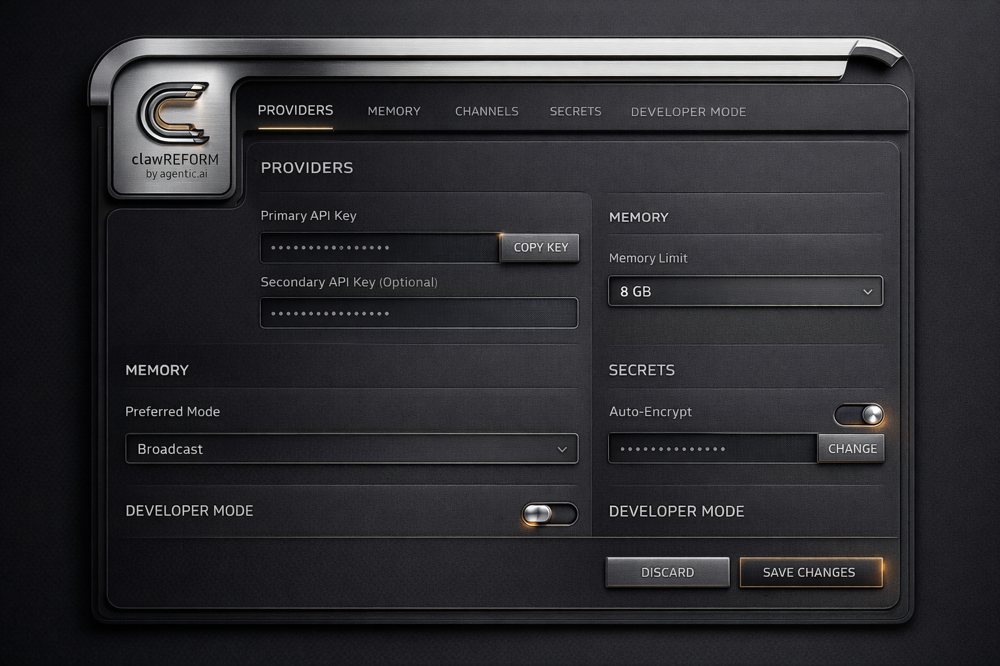

Primary:
- `reference-assets/settings-forms.png`

Support:
- `reference-assets/controls-board.png`

Why this file leads:
- best grouped settings structure
- correct input sizes
- correct toggle scale
- correct action bar placement

Locks:
- forms must use larger inputs than the current product
- settings sections should feel like trays, not loose cards
- save and cancel actions must live in a stable footer/action region

## Table And Dense Admin View

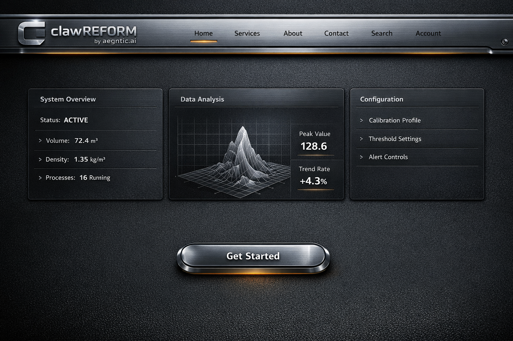

Primary:
- `reference-assets/table-admin.png`

Support:
- `reference-assets/dashboard-overview.png`

Why this file leads:
- best dense operational surface
- proves the design can survive row-heavy layouts
- strong toolbar structure
- proper table framing and badge behavior

Locks:
- dense data must still feel premium
- table rows need consistent height and breathing room
- filters and actions belong in a proper tray above the table

## Component System And Control Language

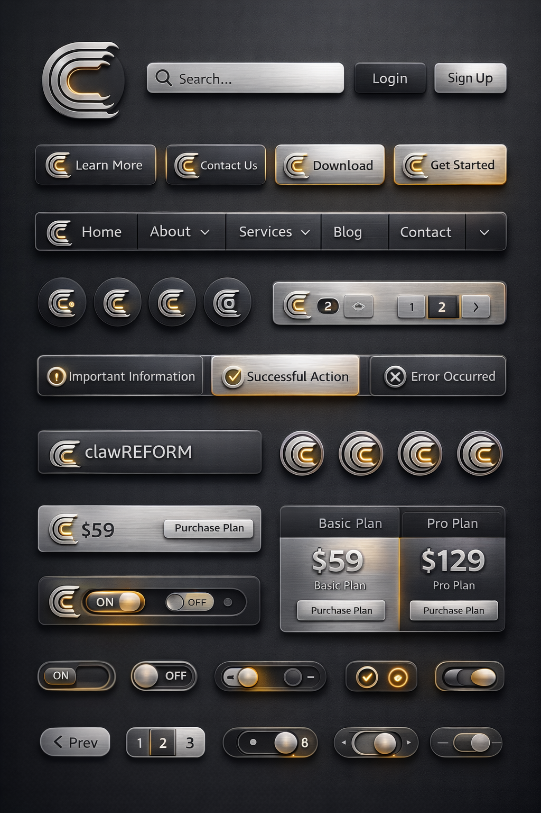

Primary:
- `reference-assets/controls-board.png`

Support:
- `reference-assets/shell-top-nav.png`

Why this file leads:
- best board for control primitives
- shows buttons, tracks, pills, selectors, badges, alerts, and toggles in one family

Locks:
- this board defines controls only
- it must not override page-level spacing from full-screen references

## Mobile Shell

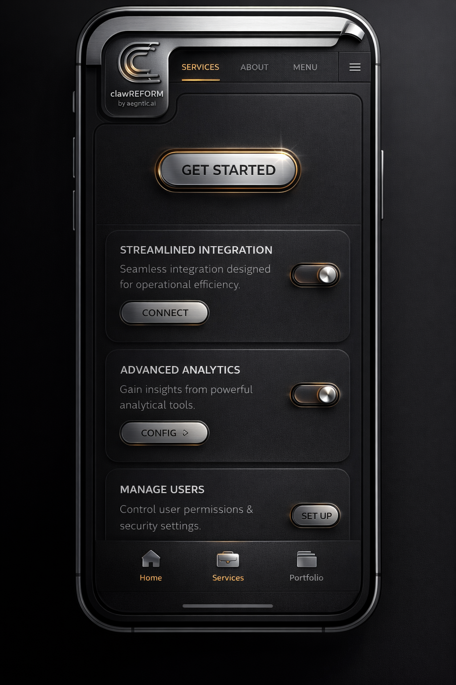

Primary:
- `reference-assets/mobile-shell.png`

Support:
- `reference-assets/mobile-dashboard.png`

Why this file leads:
- best narrow-shell composition
- good CTA scale
- good bottom navigation translation
- preserves material identity on mobile

Locks:
- mobile keeps the top-shell brand
- mobile simplifies density instead of miniaturizing desktop

## Mobile Dashboard

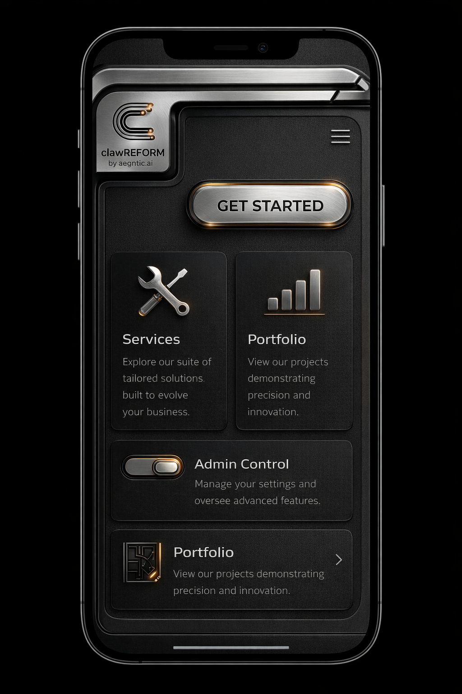

Primary:
- `reference-assets/mobile-dashboard.png`

Support:
- `reference-assets/mobile-shell.png`

Why this file leads:
- stronger stacked-card behavior
- better content rhythm below the shell

Locks:
- stacked mobile cards need strong separation
- content on mobile must stay readable first

## Brand And Logo Finish

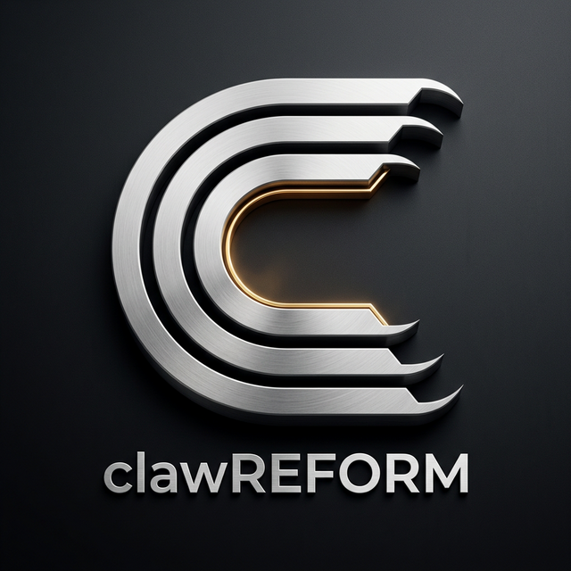

Primary:
- `reference-assets/logo-mark.png`

Support:
- `reference-assets/shell-top-nav.png`
- `reference-assets/controls-board.png`

Why this file leads:
- best standalone mark for icon cleanup
- clear metallic edge treatment
- suitable source for transparent logo refinement

Locks:
- runtime logo assets must keep the same metallic geometry
- icon scale must stay crisp at small sizes

## Page Mapping

- App shell invariant, logo tile, and page-header frame: `reference-assets/shell-border-home-tile.png`
- Dashboard home and overview panels: `reference-assets/dashboard-overview.png`
- OpenRouter gate and auth overlays: `reference-assets/auth-openrouter-gate.jpeg`
- Setup wizard and first-run flow: `reference-assets/wizard-primary.jpeg`
- Provider, memory, secrets, and developer settings: `reference-assets/settings-forms.png`
- Issue tracker, company table views, and dense admin surfaces: `reference-assets/table-admin.png`
- Buttons, toggles, pills, segmented controls, notifications, pagination: `reference-assets/controls-board.png`
- Mobile shell and mobile-first fallback: `reference-assets/mobile-shell.png`

## Gaps Still To Source

The current pool is strong enough to lock the shell reset, but still thin in these areas:

- chat workspace
- memory and obsidian graph pages
- company dashboard specific compositions
- empty states for linked and unlinked memory flows
- modal, drawer, and notification families shown in a real app context

These should be the next image pack so the rebuild does not have to infer them.

## Guardrails

- Do not use the current shipped frontend as a visual authority.
- Do not blend dark-shell layout from these files with legacy UI spacing.
- Do not let the control board dictate overall page density.
- When there is a conflict, shell references outrank component references.
- Do not ship desktop pages without the structural top border unless there is a deliberate exceptional surface.
- Do not treat the logo tile as decorative branding. It is a persistent home control.
